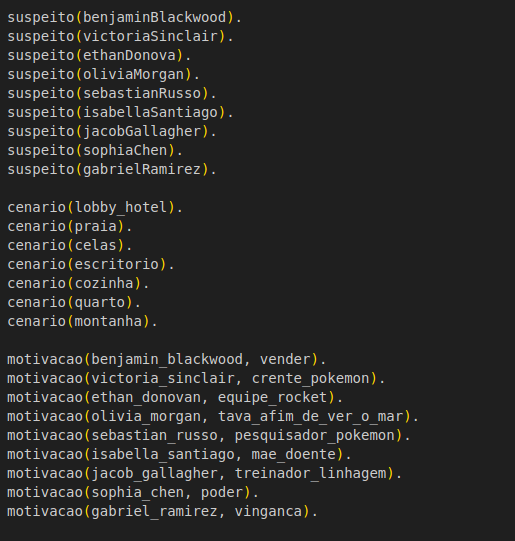

# Aspectos Técnicos
## Fatos

No jogo de investigação criminal Pokémon, os fatos fornecidos em Prolog são utilizados para criar regras e consultas que que guiem os jogadores a descobrir o culpado por trás de um crime misterioso. Cada fato é representado por um predicado, que é um termo composto por um nome e um número de argumentos. Os fatos são utilizados para representar informações sobre o crime, como suspeitos, cenários e motivações.

Suspeitos:
Os fatos "suspeito/1" fornecem uma lista de suspeitos no caso. Cada suspeito é representado por um nome. Esses fatos podem ser usados para criar um conjunto de possíveis culpados que os jogadores devem investigar.

Cenários:
Os fatos "cenario/1" indicam os locais relevantes para a investigação. Cada cenário é representado por um nome. Esses fatos podem ser usados para criar uma lista de locais onde o crime ocorreu ou onde pistas podem ser encontradas. Os jogadores podem explorar esses cenários para coletar evidências.

Motivação:
Os fatos "motivacao/2" indicam a motivação de cada suspeito. O primeiro argumento é o nome do suspeito e o segundo argumento é a motivação em si. Esses fatos podem ser utilizados para criar conexões entre suspeitos e possíveis motivos para cometerem o crime. Os jogadores podem analisar essas motivações para formar teorias sobre quem poderia ser o culpado.

## Execução via Terminal

Para executar o jogo via terminal, é necessário ter o SWI-Prolog instalado. Para isso, siga as instruções de instalação disponíveis no [site oficial](https://www.swi-prolog.org/Download.html).

Após a instalação, abra o terminal e navegue até a pasta do projeto. Em seguida, execute o comando `swipl -s main.pl` e em seguida `-? iniciar_jogo` para iniciar o jogo.

## Front-end

A implementação do front-end para o jogo de investigação criminal Pokémon utiliza a biblioteca XPCE (Cross-Platform Common Environment) do Prolog para criar a interface gráfica.

### Principais Telas

A separação de telas por fases no jogo de investigação criminal Pokémon é uma estratégia para fornecer uma experiência de jogo progressiva e orientada por etapas. Cada fase representa um estágio específico do jogo, onde novas informações, desafios e interações são apresentados aos jogadores.

### Componentes

Esses componentes são responsáveis pela criação e configuração da interface gráfica do jogo, especificamente para o frontend do jogo de investigação criminal Pokémon. Eles são utilizados para criar e configurar os elementos gráficos da interface, como janelas, botões, imagens e textos.

### Lista de Suspeitos

A lista de suspeitos é um componente que exibe os suspeitos do caso. Cada suspeito é representado por um botão que pode ser clicado para exibir informações sobre o suspeito. Essas informações são exibidas em uma janela de diálogo.

### Ambientação e Imersão

A produção de montagens autorais de imagens para serem utilizadas no jogo e criar uma ambientação personalizada é um aspecto importante para tornar a experiência do jogo de investigação criminal Pokémon mais envolvente e imersiva. Aqui está uma breve explicação sobre esse processo:

A produção de montagens autorais de imagens permite criar uma ambientação exclusiva e personalizada para o jogo de investigação criminal Pokémon. Elas ajudam a estabelecer a atmosfera do jogo, transportando os jogadores para os cenários e as situações relevantes para a história. Essas montagens contribuem para a imersão dos jogadores, tornando a experiência mais envolvente e cativante.

